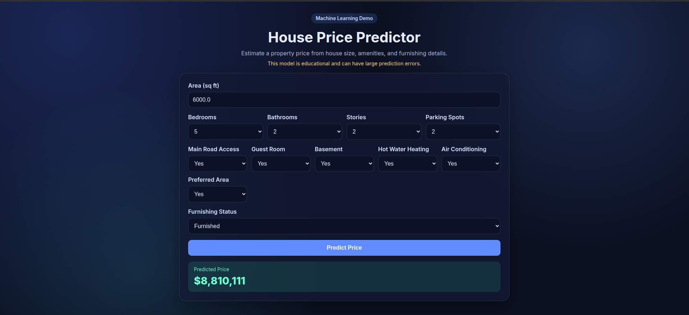

# House Price Predictor

A simple end-to-end machine learning web app that predicts house prices from core property features.

## Preview



## Features

- Predicts house price using:
  - `area`
  - `bedrooms`
  - `bathrooms`
  - `stories`
  - `parking`
  - `mainroad`, `guestroom`, `basement`
  - `hotwaterheating`, `airconditioning`, `prefarea`
  - `furnishingstatus`
- Flask web app with a modern responsive UI
- Auto-trains model if `model.pkl` does not exist
- Lightweight and beginner-friendly project structure

## Tech Stack

- **Backend:** Python, Flask
- **ML:** scikit-learn (`Pipeline`, `OneHotEncoder`, `LinearRegression`)
- **Data:** pandas
- **Frontend:** HTML, CSS (Jinja templates)

## Project Structure

```text
HousePrincing/
├── app.py               # Flask app and prediction route
├── train_model.py       # Model training + pickle export
├── Housing.csv          # Dataset
├── model.pkl            # Trained model artifact (generated)
├── templates/
│   └── index.html       # Frontend page
├── static/
│   └── style.css        # Frontend styles
├── requirements.txt     # Python dependencies
├── version 1/           # old version
└── README.md
```

## Quick Start

### 1) Clone

```bash
git clone https://github.com/issamsensi/HousePrincing.git
cd HousePrincing
```

### 2) Create and activate a virtual environment (recommended)

```bash
python -m venv .venv
source .venv/bin/activate
```

### 3) Install dependencies

```bash
pip install -r requirements.txt
```

### 4) Run the app

```bash
python app.py
```

Open: http://127.0.0.1:5000

## How it Works

1. The app loads `model.pkl` at startup.
2. If the file is missing, it runs `train_and_save()` from `train_model.py`.
3. User submits feature values from the form.
4. A pandas DataFrame is built and sent to the model.
5. Predicted price is rendered in the UI.

## Re-train the Model

If you update `Housing.csv`, run:

```bash
python train_model.py
```

This will overwrite `model.pkl` with a new model.

## Notes

- Predictions can be inaccurate and should be treated as **educational output**, not real valuation advice.
- Current model is linear and uses categorical encoding through a preprocessing pipeline.

## Future Improvements

- Add model evaluation metrics (`MAE`, `RMSE`, `R²`) in the UI or logs
- Add advanced feature engineering and non-linear models
- Add model versioning and experiment tracking
- Add unit tests + CI

## License

MIT (you can add a `LICENSE` file if needed).

## Author

Issam Sensi
